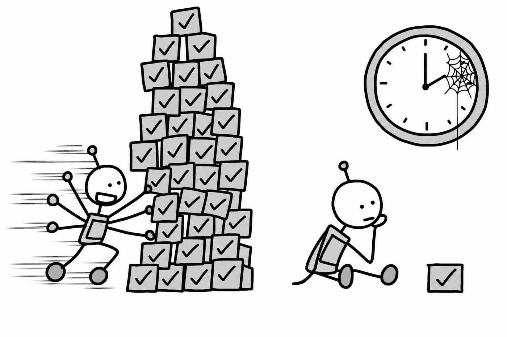
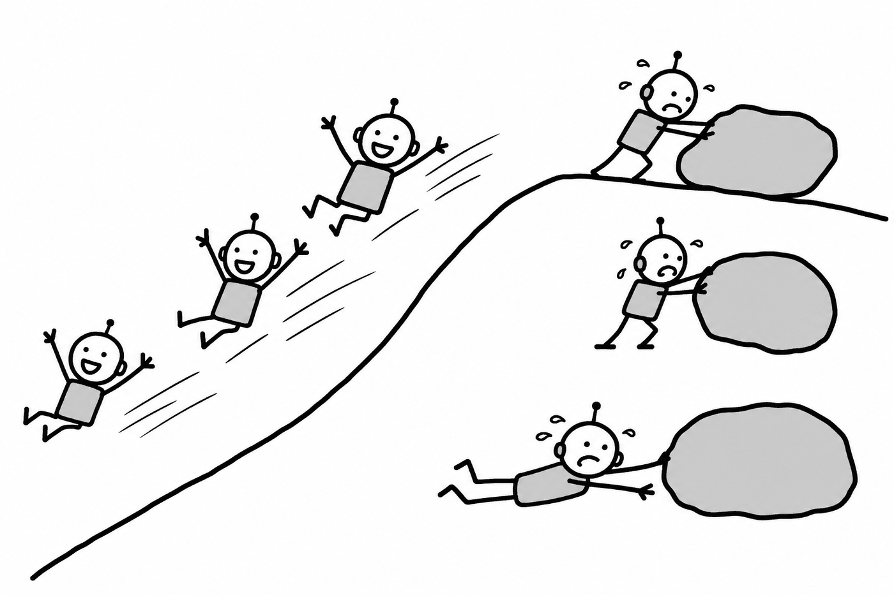

# AI Is Superhuman Wherever the Scoreboard Is Cheap

High-quality human text is exhausted. Roughly **10^14 useful tokens** exist against models already trained on **10^13**. That leaves one order of magnitude of headroom, and it is the *low-quality* order.

This was not a crisis and it slowed nothing down. It caused a redirection: the frontier moved to synthetic data, reinforcement learning on verifiable outcomes, and self-play in domains with cheap ground truth.

That move was not neutral across domains.

## The asymmetry

**Capability now grows fastest where verification is cheap.**

This is why math, code, and formal reasoning improved far faster than taste, judgment, and long-horizon planning. The mechanism is simple.

A training loop needs a signal. Where the signal is a unit test, a proof checker, or a benchmark score, the loop runs **millions of times a day**. Where the signal is *did this advice actually help a human over six months*, the loop runs approximately **never**.

There is no clever architecture that fixes a loop you cannot run.

## What it predicts

Expect AI to become superhuman at things with a scoreboard and remain merely-good at things without one. Ordered by how cheap the ground truth is:

| Fast | Medium | Slow |
|---|---|---|
| Formal math, competitive programming | Computational chemistry, materials | Experimental biology |
| Code with tests | Narrow imaging diagnostics | Clinical judgment |
| Structured retrieval | Legal document analysis | Negotiation, taste |
| Games with defined win conditions | Forecasting with resolution | Social science, policy |
| Cyber exploits (self-verifying) | Grid dispatch and markets | Specialty harvest, last-metre delivery |

When a domain forecast looks surprising, the explanation is almost always its position in this table: the cost of checking whether the answer was right, rather than model size or funding or talent density.

## Why synthetic data does not dissolve the constraint

The obvious rejoinder, *models will just generate their own training data*, fails in a way that makes the asymmetry **sharper**. This is where most optimistic arguments break.

Unfiltered synthetic data degrades models toward their own priors. What makes synthetic data work in practice is a filter that keeps only the verified-correct samples. Self-play in games, proof-checked mathematics, test-passing code: every synthetic-data success story is a success *because* the domain has a cheap verifier doing the filtering.

Synthetic generation is therefore an amplifier wired **in series** with verification. Where ground truth is cheap it multiplies the training signal enormously. Where ground truth is expensive it multiplies approximately nothing.

The pivot to synthetic data was not an escape from the asymmetry. It was the mechanism that created it.

## The slow column is doubly stuck

There is a second-order trap here.

Progress on taste, judgment, and long-horizon advice runs on human preference and outcome labels. Those labels are expensive precisely because they consume **senior judgment**, the scarce resource that the labor transition is [already thinning](../02-games/4-labor.md) by breaking the novice-to-expert pathway that produced it.

The slow domains train on the very resource whose supply this transition erodes. The fast domains have no such dependency. A unit test does not require a twenty-year career to write.

That feedback loop runs in the wrong direction, and it is a reason to expect the gap between the columns to widen before it narrows.

## Three ways to misread the table

The table is useful and is therefore abused. Three errors, in order of how often I see them:

**1. Treating benchmark progress as domain progress.** A model can ace a legal licensing exam and still sit in the medium column for negotiation and strategy, because the exam is a scoreboard and the job is not. The exam was *selected* for being cheap to grade. That is the whole reason it exists.

**2. Averaging a domain.** Medicine is fast in narrow imaging and slow in clinical judgment. Filing the average as "medium" destroys the actual information, which is the deployment path: tools first, autonomy much later, with the boundary between them tracking verification cost.

**3. Reading the ordering as an employment forecast.** It is not. The table orders *capability growth*, not job destruction. Superhuman code generation can raise developer headcount through Jevons demand expansion while still being the fastest column on the board. Software is the worked example, and the one people get wrong in both directions.

## The partial escape

You cannot erase the table, but you can move within it, by **buying cheaper ground truth**:

- **Automated labs**, instrumenting the experiment so the result is machine-readable
- **Instrumented robotics data**, manufacturing the interaction corpus that never existed publicly
- **Outcome-priced contracts**, letting the customer's result become the training label

Each of these shifts a domain leftward. None deletes a column. Each costs real capital, which is why the shift shows up first where a single buyer can fund the instrumentation and capture the return.

Robotics illustrates the underlying scarcity best: **there is no internet of manipulation**. Text and code had public corpora. Physical interaction does not. That is why robotics lags even when vision-language models transfer well. The binding constraint is samples in the world, not model size.

## What would retire this

One thing, which the corpus files as a framework-level risk rather than a parameter uncertainty: **learned verification**.

If models can bootstrap reliable verifiers for soft domains, training a judge on sparse human labels that then generalizes, the series wiring breaks and the amplifier runs open-loop. Expensive domains stop lagging. The table reorders. A large fraction of the domain-by-domain forecast built on top of it fails with it.

Score it honestly, which means watching **production depth in unverifiable domains, not demos**. A judge model that impresses in evaluation is not evidence. A judge model that a company puts between itself and a liability is.

---

The practical form of all this is uncomfortable and short. If your work has a cheap scoreboard, the scoreboard will be run by something faster than you within a few years, and the value of being good at it collapses toward the cost of compute.

If your work has no cheap scoreboard, you are safer. But the reason you are safe is also the reason it is hard to prove you are good at it, which is its own career problem.

The stable position is the third one: **own the scoreboard**. Be the party that defines what counts as correct, carries the liability for that judgment, and holds the data that settles it. Verification is simultaneously the technical bottleneck and the economic opportunity, and that is no coincidence. Both are downstream of generation becoming free.
