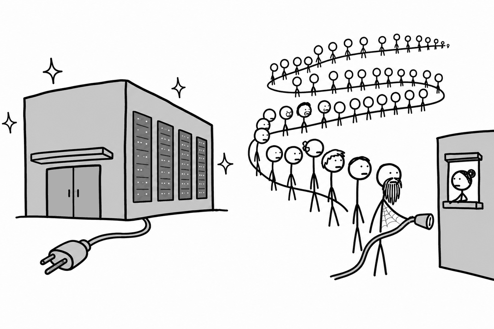
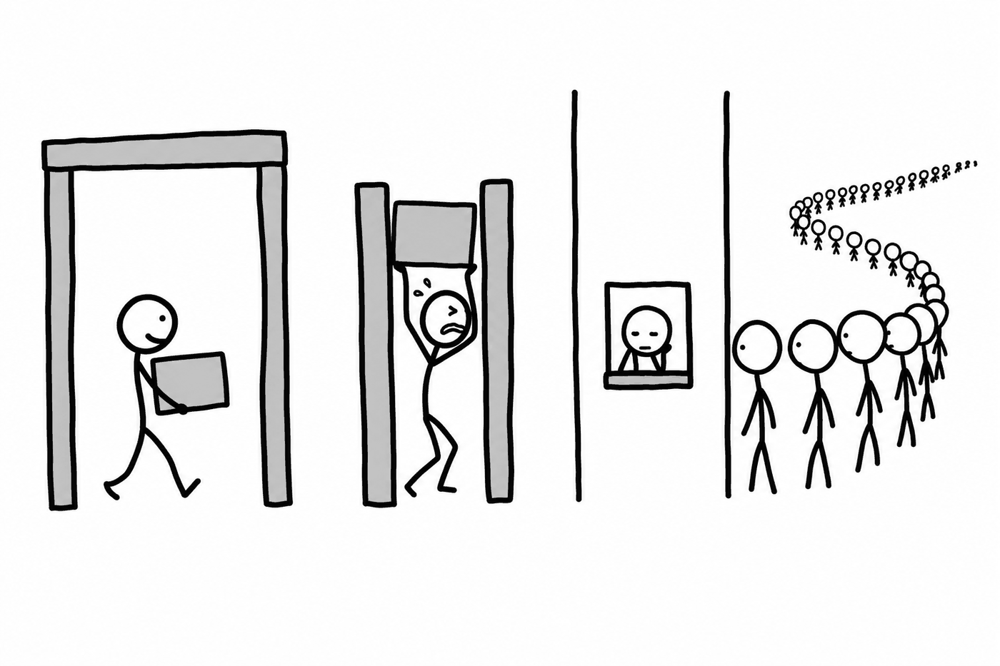

# The Bottleneck Migrates: Silicon → Electrons → Permits

A 1GW datacenter campus draws what about **800,000 homes** draw.

That comparison points at who sets the schedule for AI progress, and none of them are in California or Seattle. The supply chain behind that gigawatt is measured in years:

- US grid interconnection queues for large new loads: **5–7 years**
- Gas turbine order books: full **into 2030**
- Transformers: **2–3 year** lead times

You cannot software-engineer your way past a substation.

## The queue, quantified

"Interconnection queue" is an abstraction that hides how badly the arithmetic fails. As of 2026:

| Market | Queue volume | Typical wait |
|---|---|---|
| CAISO | ~410 GW | 5–6 years |
| MISO | ~380 GW | ~5 years |
| ERCOT | n/a | 3–4 years for >75MW campus loads |

Now put the other number beside it. A hyperscale facility is **built in 1–3 years**.

The construction cycle is shorter than the permission cycle, which means the binding constraint is not the thing being built. On interconnection and construction bottlenecks alone, roughly **30–50% of planned 2026 AI datacenter capacity is expected to slip to 2028**.

That is not a forecast about model capability. It is a forecast about paperwork, and it moves capability timelines anyway.

## ERCOT is the tell

Look at the table again. ERCOT's advantage is not geography, weather, capital, or engineering talent. It is a different regulatory structure.

**The variance across US markets is larger than the variance across countries.** A gigawatt in Texas and a gigawatt in California are the same physics and a completely different calendar. When the spread within one country exceeds the spread between countries, you are not looking at a resource constraint. You are looking at an institutional one.

**The bottleneck migrates from silicon to electrons to permits.**

By 2028 the rate-limiting step on frontier AI in the US is environmental review, transmission rights-of-way, and turbine manufacturing. Export controls address *China's* bottleneck. They do nothing about America's.

The corollary would have sounded absurd in 2023 and now sets the schedule: **AI progress is partly a function of American administrative law.**

## When the queue is the constraint, leave the queue

That is exactly what 2025–26 capital allocation shows:

- **Direct generation ownership.** Alphabet's ~**$4.75B** acquisition of Intersect Power, announced 2025-12-22 and closing H1 2026, moves risk out of grid queues and into owned generation-plus-storage packages.
- **Nuclear restarts and offtakes.** Microsoft's Three Mile Island restart, plus Amazon and Google contracting small modular reactors for carbon-free baseload.
- **On-site gas.** Fastest to deploy, worst politically, and the default when the schedule binds.

This changes what these companies are. **A frontier lab is becoming a power company with a research division attached.** The relevant competence shifts from ML engineering toward project finance, EPC management, and regulatory affairs. Expect org charts to follow the constraint within two years of it binding, so watch who gets hired as much as what gets announced.

> **Prediction:** by 2029, **>40%** of new frontier-training capacity in the US is powered by generation the operator owns or has contracted bilaterally, rather than grid supply procured at tariff. The grid becomes the backup, not the source. **~65%** confidence. This mostly extrapolates capital already committed by mid-2026. The miss scenario is permitting reform making tariff supply competitive again, not a reversal of intent.

## Why the supply chain does not fix itself

The textbook response to a demand spike is capacity expansion. Turbine and transformer manufacturers should be building plants. They are doing so slowly and late, and their reluctance is **rational**.

Heavy electrical equipment plants take years to build and decades to pay back. The demand signal in front of them is a single sector's five-year build-out with a known correction scenario attached. Manufacturers who overbuilt into past electricity booms ate decade-long busts, and the firms still standing are the ones that learned that lesson.

So order books full into 2030 are being served by overtime and brownfield debottlenecking, not greenfield plants. The supply chain converts a demand surge into **queue length rather than volume**: backlogs stretch, prices rise, capacity barely moves.

This is the industrial-base version of the permitting problem. Both are institutions optimized for a stable grid being asked to price a spike they have good reason to distrust. Sovereign-backed offtake guarantees or defense-production-style procurement would change the manufacturers' math overnight, which is why equipment lead times belong on the same watch list as statutes.

## What behind-the-meter still owes the grid

Behind-the-meter has a physical dependency the strategy discussion tends to skip. **Islanded loads still need firm backup**, and grid-scale storage or redundant generation adds real cost to the headline $/MW figures.

The load mix is also changing underneath the argument. Training tolerates interruption. Inference serving increasingly does not, because it carries customer SLAs. As Jevons expansion shifts the mix from training toward serving, the interruptibility advantage that makes curtailment-tolerant interconnection cheap erodes.

The industry's flexibility story is truest in exactly the phase of the build-out that is ending first.

## The electricity bill is the regulation

The constraint has a consumer-facing side that will dominate the politics long before it dominates the engineering.

Wholesale electricity costs near US datacenter concentrations have risen sharply, on the order of **+267%** at the most affected nodes over 2020–25 (Bloomberg node analysis). On PJM, the largest US market, average wholesale cost rose roughly **76% year-on-year** into early 2026, with the market monitor naming datacenter load growth as the primary driver.

That number is the seed of the backlash, and the mechanism is simple enough to survive contact with a campaign ad. A large inflexible load arrives in a constrained market, clears at the top of the supply stack, and every ratepayer in the zone sees it on a monthly bill. The benefits are national and diffuse. The costs are local and itemized.

**This is the most likely source of binding domestic AI regulation in the US, ahead of safety, labor, or copyright.** Electricity price is the one channel through which the abstraction touches a median voter's budget on a monthly cycle. Expect state-level siting restrictions, ratepayer-protection rules, and special large-load tariffs well before any federal capability regulation.

## The geopolitical consequence

Countries that can build power fast gain structural advantage **that has nothing to do with their AI research talent**:

- **China**, at ~**300GW/yr** of generation additions, roughly an order of magnitude above US net additions, with permitting that is an instrument of policy rather than an obstacle to it
- **Gulf states**, with sovereign capital, abundant gas, and minimal permitting friction
- **A second tier** of India, Brazil, and Indonesia, with the additions but not yet the transmission or the demand-side buyers

This decouples AI *capacity* from AI *capability*. A country can lead in published research and still be unable to deploy at scale, or the reverse. Most existing analysis conflates the two.

## Why this could loosen fast

This is politics, not physics, and that cuts against the pessimistic reading.

Interconnection queues, environmental review, and transmission siting are statutory and revisable. The constraint can loosen suddenly and cannot tighten much further, so the distribution is skewed toward **faster** than the base case here assumes. Two further things push the same way:

- **Load flexibility is nearly free and barely used.** Training is interruptible. A datacenter willing to curtail during peak hours can interconnect far faster than one demanding firm capacity, and the industry has only begun to price this.
- **Efficiency compounds on the demand side.** The GW figures assume today's FLOPs-per-watt. Three years of accelerator efficiency gains at historical rates cut energy per unit of capability substantially, even as total draw rises.

Jevons still wins on the total. But the ceiling moves.

## What to watch

Three series, not one, because they can diverge and the divergence is informative:

1. **Queue length**, the political constraint
2. **Behind-the-meter share of new MW**, the routing path around it
3. **Interruptible share of new datacenter contracts**, the fix that is nearly free and barely used

Queue length can look stuck while training capacity grows fine, if the money has simply routed around the public rate case. Read all three or you will misread the first.

---

The failure mode of this analysis is treating every delayed datacenter announcement as proof the wall arrived early. Discretionary delay, chip allocation, and power queues can each slip a project without the economic ceiling binding at all.

But the direction is not in much doubt. For thirty years the question in this industry was whether you could get the chips. For the next ten it is whether you can get the interconnect, and that question is answered by a public utility commission, on a timeline set by statute rather than by the industry.
